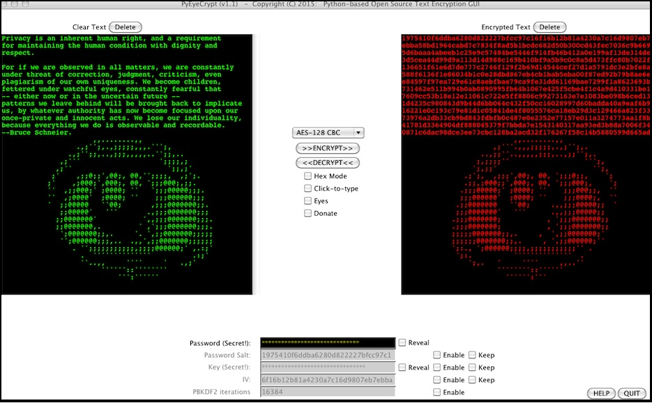

#**PyEyeCrypt**
---

Text encryption GUI in open-source Python 2, with multiple ciphers, e.g. aes 128.




**Checksums (v1.0):**

MD5 (PyEyeCrypt.py)      = a62fdbd9169e040c65923043b68d8126<br>
MD5 (aes.py)             = 0382f1d2ec99e4fa1078ebf2a9fa5698<br>
MD5 (pbkdf2.py)          = aafdc003eeebc03e9f747b24b9421408<br>
MD5 (PyEyeCrypt.app.tgz) = c033c129d6760be1650bcb39aa57c926<br>
MD5 (PyEyeCrypt)         = 237213eba0d7671aef8b591904d596a4<br>

**OSX/Linux Usage:**

With Python (requires tkinter):

```python PyEyeCrypt.py```

Without Python:

Unix: ```./PyEyeCrypt```

OSX : Untar the .tgz file & drag the app onto your Dock, Desktop or wherever. Double-click.

**Windows:**

The new Windows 10 Privacy Statement includes the words:<br>
'your typed and handwritten words are collected'.

This means that passwords typed by a single recipient when decrypting using
Win10 would, *unknown to the sender*, jeopardise the sender's password!

This behaviour is akin to a keylogging virus.<br>
It is therefore NOT suitable to use Win10 with PyEyeCrypt!

I am working on countermeasures; such as a mouse-operated keypad for Password & Clear-Text entry.
I would welcome suggestions on such countermeasures.

